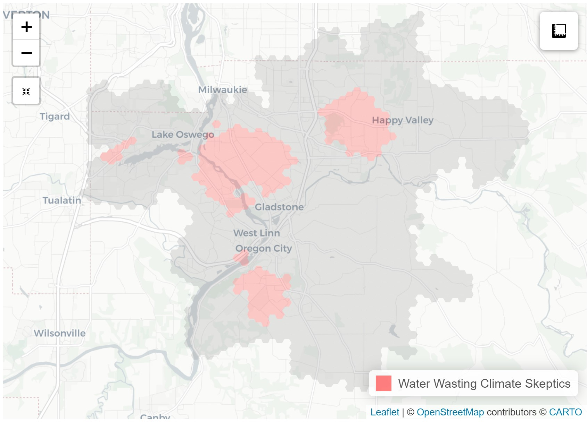

# Mapping Water Customer Clusters

## Overview

I chose to showcase this project because it had a lot of diverse elements:collaboration with multiple stakeholders, data collection, messy data,data from multiple sources,geocoding using Google API, exploratory anaylses, machine learning (segmentation),use of an additional analysis platform (ArcGIS Pro), and mapping. The final result helped inform the “Save it for the Salmon” and the ongoing “Clackamas Watershed Resiliency Project”.

## Purpose

Segmentation, more specifically psychographic and behavioral segmentation, is common in the electrical utility sector but not water. I thought this would be a novel contribution. I was curious how water customer attitudes around water conservation and climate change manifested among customers with the intutition that there are different customer “archetypes”. Knowing about these archetypes can help focus messaging and this project was developed as the starting point for an ongoing social marketing campaign around watershed conservation and protection.

## Research Questions

1. Do water customer attitudes show attitudinal clustering around climate change, water conservation,trust, and place attitudes.

2. Do these attitudinal clusters exhibit spatial clustering within the water service area?

## Example

